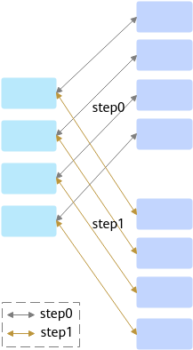

# HcclCommInitRootInfoConfig<a name="ZH-CN_TOPIC_0000002487008052"></a>

## 产品支持情况<a name="zh-cn_topic_0000001893330870_section10594071513"></a>

<a name="zh-cn_topic_0000001893330870_table38301303189"></a>
<table><thead align="left"><tr id="zh-cn_topic_0000001893330870_row20831180131817"><th class="cellrowborder" valign="top" width="57.99999999999999%" id="mcps1.1.3.1.1"><p id="zh-cn_topic_0000001893330870_p1883113061818"><a name="zh-cn_topic_0000001893330870_p1883113061818"></a><a name="zh-cn_topic_0000001893330870_p1883113061818"></a><span id="zh-cn_topic_0000001893330870_ph20833205312295"><a name="zh-cn_topic_0000001893330870_ph20833205312295"></a><a name="zh-cn_topic_0000001893330870_ph20833205312295"></a>产品</span></p>
</th>
<th class="cellrowborder" align="center" valign="top" width="42%" id="mcps1.1.3.1.2"><p id="zh-cn_topic_0000001893330870_p783113012187"><a name="zh-cn_topic_0000001893330870_p783113012187"></a><a name="zh-cn_topic_0000001893330870_p783113012187"></a>是否支持</p>
</th>
</tr>
</thead>
<tbody><tr id="zh-cn_topic_0000001893330870_row220181016240"><td class="cellrowborder" valign="top" width="57.99999999999999%" headers="mcps1.1.3.1.1 "><p id="zh-cn_topic_0000001893330870_p48327011813"><a name="zh-cn_topic_0000001893330870_p48327011813"></a><a name="zh-cn_topic_0000001893330870_p48327011813"></a><span id="zh-cn_topic_0000001893330870_ph583230201815"><a name="zh-cn_topic_0000001893330870_ph583230201815"></a><a name="zh-cn_topic_0000001893330870_ph583230201815"></a><term id="zh-cn_topic_0000001893330870_zh-cn_topic_0000001312391781_term1253731311225"><a name="zh-cn_topic_0000001893330870_zh-cn_topic_0000001312391781_term1253731311225"></a><a name="zh-cn_topic_0000001893330870_zh-cn_topic_0000001312391781_term1253731311225"></a>Atlas A3 训练系列产品/Atlas A3 推理系列产品</term></span></p>
</td>
<td class="cellrowborder" align="center" valign="top" width="42%" headers="mcps1.1.3.1.2 "><p id="zh-cn_topic_0000001893330870_p7948163910184"><a name="zh-cn_topic_0000001893330870_p7948163910184"></a><a name="zh-cn_topic_0000001893330870_p7948163910184"></a>√</p>
</td>
</tr>
<tr id="zh-cn_topic_0000001893330870_row173226882415"><td class="cellrowborder" valign="top" width="57.99999999999999%" headers="mcps1.1.3.1.1 "><p id="zh-cn_topic_0000001893330870_p14832120181815"><a name="zh-cn_topic_0000001893330870_p14832120181815"></a><a name="zh-cn_topic_0000001893330870_p14832120181815"></a><span id="zh-cn_topic_0000001893330870_ph1292674871116"><a name="zh-cn_topic_0000001893330870_ph1292674871116"></a><a name="zh-cn_topic_0000001893330870_ph1292674871116"></a><term id="zh-cn_topic_0000001893330870_zh-cn_topic_0000001312391781_term11962195213215"><a name="zh-cn_topic_0000001893330870_zh-cn_topic_0000001312391781_term11962195213215"></a><a name="zh-cn_topic_0000001893330870_zh-cn_topic_0000001312391781_term11962195213215"></a>Atlas A2 训练系列产品/Atlas A2 推理系列产品</term></span></p>
</td>
<td class="cellrowborder" align="center" valign="top" width="42%" headers="mcps1.1.3.1.2 "><p id="zh-cn_topic_0000001893330870_p19948143911820"><a name="zh-cn_topic_0000001893330870_p19948143911820"></a><a name="zh-cn_topic_0000001893330870_p19948143911820"></a>√</p>
</td>
</tr>
</tbody>
</table>

> [!NOTE]说明
> 针对Atlas A2 训练系列产品/Atlas A2 推理系列产品，仅支持Atlas 800T A2 训练服务器、Atlas 900 A2 PoD 集群基础单元、Atlas 200T A2 Box16 异构子框。

## 功能说明<a name="zh-cn_topic_0000001893330870_section60885635"></a>

根据rootInfo初始化HCCL，创建具有特定配置的HCCL通信域。

该接口在同一进程内支持多线程并发调用，但仅支持单卡单线程的场景，若是单卡多线程，不支持并发调用。

如下图所示，不支持step0与step1并发调用，需要step0执行结束后，再串行执行step1。



## 函数原型<a name="zh-cn_topic_0000001893330870_section14221611"></a>

```
HcclResult HcclCommInitRootInfoConfig(uint32_t nRanks, const HcclRootInfo *rootInfo, uint32_t rank, const HcclCommConfig *config, HcclComm *comm)
```

## 参数说明<a name="zh-cn_topic_0000001893330870_section11099805"></a>

<a name="zh-cn_topic_0000001893330870_table49150562"></a>
<table><thead align="left"><tr id="zh-cn_topic_0000001893330870_row42137308"><th class="cellrowborder" valign="top" width="20.200000000000003%" id="mcps1.1.4.1.1"><p id="zh-cn_topic_0000001893330870_p57678784"><a name="zh-cn_topic_0000001893330870_p57678784"></a><a name="zh-cn_topic_0000001893330870_p57678784"></a>参数名</p>
</th>
<th class="cellrowborder" valign="top" width="17.169999999999998%" id="mcps1.1.4.1.2"><p id="zh-cn_topic_0000001893330870_p41469957"><a name="zh-cn_topic_0000001893330870_p41469957"></a><a name="zh-cn_topic_0000001893330870_p41469957"></a>输入/输出</p>
</th>
<th class="cellrowborder" valign="top" width="62.629999999999995%" id="mcps1.1.4.1.3"><p id="zh-cn_topic_0000001893330870_p3623379"><a name="zh-cn_topic_0000001893330870_p3623379"></a><a name="zh-cn_topic_0000001893330870_p3623379"></a>描述</p>
</th>
</tr>
</thead>
<tbody><tr id="zh-cn_topic_0000001893330870_row25058257"><td class="cellrowborder" valign="top" width="20.200000000000003%" headers="mcps1.1.4.1.1 "><p id="zh-cn_topic_0000001893330870_p16452903"><a name="zh-cn_topic_0000001893330870_p16452903"></a><a name="zh-cn_topic_0000001893330870_p16452903"></a>nRanks</p>
</td>
<td class="cellrowborder" valign="top" width="17.169999999999998%" headers="mcps1.1.4.1.2 "><p id="zh-cn_topic_0000001893330870_p57616766"><a name="zh-cn_topic_0000001893330870_p57616766"></a><a name="zh-cn_topic_0000001893330870_p57616766"></a>输入</p>
</td>
<td class="cellrowborder" valign="top" width="62.629999999999995%" headers="mcps1.1.4.1.3 "><p id="zh-cn_topic_0000001893330870_p36446461"><a name="zh-cn_topic_0000001893330870_p36446461"></a><a name="zh-cn_topic_0000001893330870_p36446461"></a>集群中的rank数量。</p>
</td>
</tr>
<tr id="zh-cn_topic_0000001893330870_row59582700"><td class="cellrowborder" valign="top" width="20.200000000000003%" headers="mcps1.1.4.1.1 "><p id="zh-cn_topic_0000001893330870_p61469371"><a name="zh-cn_topic_0000001893330870_p61469371"></a><a name="zh-cn_topic_0000001893330870_p61469371"></a>rootInfo</p>
</td>
<td class="cellrowborder" valign="top" width="17.169999999999998%" headers="mcps1.1.4.1.2 "><p id="zh-cn_topic_0000001893330870_p12963143"><a name="zh-cn_topic_0000001893330870_p12963143"></a><a name="zh-cn_topic_0000001893330870_p12963143"></a>输入</p>
</td>
<td class="cellrowborder" valign="top" width="62.629999999999995%" headers="mcps1.1.4.1.3 "><p id="zh-cn_topic_0000001893330870_p43381623"><a name="zh-cn_topic_0000001893330870_p43381623"></a><a name="zh-cn_topic_0000001893330870_p43381623"></a>root rank信息，主要包含root rank的ip、id等信息，由<a href="HcclGetRootInfo.md#ZH-CN_TOPIC_0000002519087941">HcclGetRootInfo</a>接口生成。</p>
</td>
</tr>
<tr id="zh-cn_topic_0000001893330870_row54890288"><td class="cellrowborder" valign="top" width="20.200000000000003%" headers="mcps1.1.4.1.1 "><p id="zh-cn_topic_0000001893330870_p16928338"><a name="zh-cn_topic_0000001893330870_p16928338"></a><a name="zh-cn_topic_0000001893330870_p16928338"></a>rank</p>
</td>
<td class="cellrowborder" valign="top" width="17.169999999999998%" headers="mcps1.1.4.1.2 "><p id="zh-cn_topic_0000001893330870_p29018124"><a name="zh-cn_topic_0000001893330870_p29018124"></a><a name="zh-cn_topic_0000001893330870_p29018124"></a>输入</p>
</td>
<td class="cellrowborder" valign="top" width="62.629999999999995%" headers="mcps1.1.4.1.3 "><p id="zh-cn_topic_0000001893330870_p1657863"><a name="zh-cn_topic_0000001893330870_p1657863"></a><a name="zh-cn_topic_0000001893330870_p1657863"></a>本rank的rank id。</p>
</td>
</tr>
<tr id="zh-cn_topic_0000001893330870_row6401141117915"><td class="cellrowborder" valign="top" width="20.200000000000003%" headers="mcps1.1.4.1.1 "><p id="zh-cn_topic_0000001893330870_p240214111093"><a name="zh-cn_topic_0000001893330870_p240214111093"></a><a name="zh-cn_topic_0000001893330870_p240214111093"></a>config</p>
</td>
<td class="cellrowborder" valign="top" width="17.169999999999998%" headers="mcps1.1.4.1.2 "><p id="zh-cn_topic_0000001893330870_p940218116912"><a name="zh-cn_topic_0000001893330870_p940218116912"></a><a name="zh-cn_topic_0000001893330870_p940218116912"></a>输入</p>
</td>
<td class="cellrowborder" valign="top" width="62.629999999999995%" headers="mcps1.1.4.1.3 "><p id="zh-cn_topic_0000001893330870_p184021111894"><a name="zh-cn_topic_0000001893330870_p184021111894"></a><a name="zh-cn_topic_0000001893330870_p184021111894"></a>通信域配置项，包括buffer大小、确定性计算开关、通信域名称、通信算法编排展开位置等信息，配置参数需确保在合法值域内，关于HcclCommConfig中的详细参数含义及优先级可参见<a href="HcclCommConfig.md#ZH-CN_TOPIC_0000002486848108">HcclCommConfig</a>的定义。</p>
<p id="zh-cn_topic_0000001893330870_p4711134111213"><a name="zh-cn_topic_0000001893330870_p4711134111213"></a><a name="zh-cn_topic_0000001893330870_p4711134111213"></a>需要注意：传入的config必须先调用<a href="HcclCommConfigInit.md#ZH-CN_TOPIC_0000002486848092">HcclCommConfigInit</a>对其进行初始化。</p>
</td>
</tr>
<tr id="zh-cn_topic_0000001893330870_row14920772"><td class="cellrowborder" valign="top" width="20.200000000000003%" headers="mcps1.1.4.1.1 "><p id="zh-cn_topic_0000001893330870_p623043"><a name="zh-cn_topic_0000001893330870_p623043"></a><a name="zh-cn_topic_0000001893330870_p623043"></a>comm</p>
</td>
<td class="cellrowborder" valign="top" width="17.169999999999998%" headers="mcps1.1.4.1.2 "><p id="zh-cn_topic_0000001893330870_p50466518"><a name="zh-cn_topic_0000001893330870_p50466518"></a><a name="zh-cn_topic_0000001893330870_p50466518"></a>输出</p>
</td>
<td class="cellrowborder" valign="top" width="62.629999999999995%" headers="mcps1.1.4.1.3 "><p id="zh-cn_topic_0000001893330870_p61256166"><a name="zh-cn_topic_0000001893330870_p61256166"></a><a name="zh-cn_topic_0000001893330870_p61256166"></a>初始化后的通信域指针。</p>
<p id="zh-cn_topic_0000001893330870_p2268183195216"><a name="zh-cn_topic_0000001893330870_p2268183195216"></a><a name="zh-cn_topic_0000001893330870_p2268183195216"></a>HcclComm类型的定义可参见<a href="HcclComm.md#ZH-CN_TOPIC_0000002519087957">HcclComm</a>。</p>
</td>
</tr>
</tbody>
</table>

## 返回值<a name="zh-cn_topic_0000001893330870_section32789387"></a>

[HcclResult](HcclResult.md#ZH-CN_TOPIC_0000002487008064)：接口成功返回HCCL\_SUCCESS，其他失败。

## 约束说明<a name="zh-cn_topic_0000001893330870_section26669028"></a>

同一通信域中所有rank的nRanks、rootInfo、config均应相同。

## 调用示例<a name="zh-cn_topic_0000001893330870_section204039211474"></a>

```c
uint32_t rankSize = 8;
uint32_t deviceId = 0;
// 生成 root 节点的 rank 标识信息
HcclRootInfo rootInfo;
HcclGetRootInfo(&rootInfo);

// 创建并初始化通信域配置项
HcclCommConfig config;
HcclCommConfigInit(&config);
// 按需修改通信域配置
config.hcclBufferSize = 1024;  // 共享数据的缓存区大小，单位为：MB，取值需 >= 1，默认值为：200
config.hcclDeterministic = 1;  // 开启归约类通信算子的确定性计算，默认值为：0，表示关闭确定性计算功能
std::strcpy(config.hcclCommName, "comm_1");
// 初始化集合通信域
HcclComm hcclComm;
HCCLCHECK(HcclCommInitRootInfoConfig(rankSize, &rootInfo, deviceId, &config, &hcclComm));

// 销毁通信域
HcclCommDestroy(hcclComm);
```

