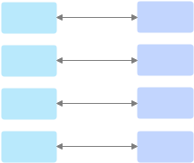
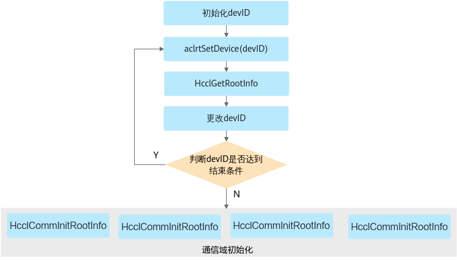

# HcclGetRootInfo<a name="ZH-CN_TOPIC_0000002519087941"></a>

## 产品支持情况<a name="zh-cn_topic_0000001265241214_section10594071513"></a>

<a name="zh-cn_topic_0000001265241214_table38301303189"></a>
<table><thead align="left"><tr id="zh-cn_topic_0000001265241214_row20831180131817"><th class="cellrowborder" valign="top" width="57.99999999999999%" id="mcps1.1.3.1.1"><p id="zh-cn_topic_0000001265241214_p1883113061818"><a name="zh-cn_topic_0000001265241214_p1883113061818"></a><a name="zh-cn_topic_0000001265241214_p1883113061818"></a><span id="zh-cn_topic_0000001265241214_ph20833205312295"><a name="zh-cn_topic_0000001265241214_ph20833205312295"></a><a name="zh-cn_topic_0000001265241214_ph20833205312295"></a>产品</span></p>
</th>
<th class="cellrowborder" align="center" valign="top" width="42%" id="mcps1.1.3.1.2"><p id="zh-cn_topic_0000001265241214_p783113012187"><a name="zh-cn_topic_0000001265241214_p783113012187"></a><a name="zh-cn_topic_0000001265241214_p783113012187"></a>是否支持</p>
</th>
</tr>
</thead>
<tbody><tr id="zh-cn_topic_0000001265241214_row220181016240"><td class="cellrowborder" valign="top" width="57.99999999999999%" headers="mcps1.1.3.1.1 "><p id="zh-cn_topic_0000001265241214_p48327011813"><a name="zh-cn_topic_0000001265241214_p48327011813"></a><a name="zh-cn_topic_0000001265241214_p48327011813"></a><span id="zh-cn_topic_0000001265241214_ph583230201815"><a name="zh-cn_topic_0000001265241214_ph583230201815"></a><a name="zh-cn_topic_0000001265241214_ph583230201815"></a><term id="zh-cn_topic_0000001265241214_zh-cn_topic_0000001312391781_term1253731311225"><a name="zh-cn_topic_0000001265241214_zh-cn_topic_0000001312391781_term1253731311225"></a><a name="zh-cn_topic_0000001265241214_zh-cn_topic_0000001312391781_term1253731311225"></a>Atlas A3 训练系列产品/Atlas A3 推理系列产品</term></span></p>
</td>
<td class="cellrowborder" align="center" valign="top" width="42%" headers="mcps1.1.3.1.2 "><p id="zh-cn_topic_0000001265241214_p7948163910184"><a name="zh-cn_topic_0000001265241214_p7948163910184"></a><a name="zh-cn_topic_0000001265241214_p7948163910184"></a>√</p>
</td>
</tr>
<tr id="zh-cn_topic_0000001265241214_row173226882415"><td class="cellrowborder" valign="top" width="57.99999999999999%" headers="mcps1.1.3.1.1 "><p id="zh-cn_topic_0000001265241214_p14832120181815"><a name="zh-cn_topic_0000001265241214_p14832120181815"></a><a name="zh-cn_topic_0000001265241214_p14832120181815"></a><span id="zh-cn_topic_0000001265241214_ph1292674871116"><a name="zh-cn_topic_0000001265241214_ph1292674871116"></a><a name="zh-cn_topic_0000001265241214_ph1292674871116"></a><term id="zh-cn_topic_0000001265241214_zh-cn_topic_0000001312391781_term11962195213215"><a name="zh-cn_topic_0000001265241214_zh-cn_topic_0000001312391781_term11962195213215"></a><a name="zh-cn_topic_0000001265241214_zh-cn_topic_0000001312391781_term11962195213215"></a>Atlas A2 训练系列产品/Atlas A2 推理系列产品</term></span></p>
</td>
<td class="cellrowborder" align="center" valign="top" width="42%" headers="mcps1.1.3.1.2 "><p id="zh-cn_topic_0000001265241214_p19948143911820"><a name="zh-cn_topic_0000001265241214_p19948143911820"></a><a name="zh-cn_topic_0000001265241214_p19948143911820"></a>√</p>
</td>
</tr>
</tbody>
</table>

> [!NOTE]说明
> 针对Atlas A2 训练系列产品/Atlas A2 推理系列产品，仅支持Atlas 800T A2 训练服务器、Atlas 900 A2 PoD 集群基础单元、Atlas 200T A2 Box16 异构子框。

## 功能说明<a name="zh-cn_topic_0000001265241214_section38679683"></a>

此接口需要在HCCL初始化接口[HcclCommInitRootInfo](HcclCommInitRootInfo.md#ZH-CN_TOPIC_0000002519007949)或[HcclCommInitRootInfoConfig](HcclCommInitRootInfoConfig.md#ZH-CN_TOPIC_0000002487008052)前调用，仅需在root节点调用，用于生成root节点的rank标识信息（HcclRootInfo）。

-   该接口需要和初始化接口[HcclCommInitRootInfo](HcclCommInitRootInfo.md#ZH-CN_TOPIC_0000002519007949)或[HcclCommInitRootInfoConfig](HcclCommInitRootInfoConfig.md#ZH-CN_TOPIC_0000002487008052)接口配对使用，不能单独使用。

-   该接口支持单线程循环调用，即开发者可在一个for循环中通过“指定不同的Device + 调用此接口”，从而实现在一个线程中获取不同设备的rootInfo信息。

    假设一个AI Server中有8张卡，8张卡分成4个通信域，每个通信域中的两张卡之间通信，如下图所示。

    **图 1**  通信域划分示例<a name="zh-cn_topic_0000001265241214_fig058062505614"></a>  
    

    获取rootInfo信息并进行集合通信初始化的流程如[图2](#zh-cn_topic_0000001265241214_fig1933232694312)所示。首先在一个线程中通过切换Device创建4个rootInfo信息，并存入一个长度为4的数组中。rootInfo信息获取完成后，起4个线程，分别调用HcclCommInitRootInfo或者HcclCommInitRootInfoConfig接口（[图2](#zh-cn_topic_0000001265241214_fig1933232694312)中以HcclCommInitRootInfo接口示意）根据不同的rootInfo信息进行通信域初始化。

    **图 2**  单线程循环调用示例<a name="zh-cn_topic_0000001265241214_fig1933232694312"></a>  
    

-   多机集合通信场景，调用HcclGetRootInfo前，可以进行如下操作（非必选）：
    -   配置环境变量HCCL\_IF\_IP或HCCL\_SOCKET\_IFNAME，指定HCCL的初始化root网卡IP（环境变量HCCL\_IF\_IP的优先级高于HCCL\_SOCKET\_IFNAME，若二者都不配置，默认使用网卡名称的字典序升序选择root网卡）。
    -   配置环境变量HCCL\_WHITELIST\_DISABLE开启白名单校验，并通过HCCL\_WHITELIST\_FILE指定通信白名单配置文件（若不配置，默认关闭通信白名单校验）。

## 函数原型<a name="zh-cn_topic_0000001265241214_section41580444"></a>

```
HcclResult HcclGetRootInfo(HcclRootInfo *rootInfo)
```

## 参数说明<a name="zh-cn_topic_0000001265241214_section12572829"></a>

<a name="zh-cn_topic_0000001265241214_table23120425"></a>
<table><thead align="left"><tr id="zh-cn_topic_0000001265241214_row45797138"><th class="cellrowborder" valign="top" width="20.200000000000003%" id="mcps1.1.4.1.1"><p id="zh-cn_topic_0000001265241214_p18580737"><a name="zh-cn_topic_0000001265241214_p18580737"></a><a name="zh-cn_topic_0000001265241214_p18580737"></a>参数名</p>
</th>
<th class="cellrowborder" valign="top" width="17.169999999999998%" id="mcps1.1.4.1.2"><p id="zh-cn_topic_0000001265241214_p28644761"><a name="zh-cn_topic_0000001265241214_p28644761"></a><a name="zh-cn_topic_0000001265241214_p28644761"></a>输入/输出</p>
</th>
<th class="cellrowborder" valign="top" width="62.629999999999995%" id="mcps1.1.4.1.3"><p id="zh-cn_topic_0000001265241214_p38524289"><a name="zh-cn_topic_0000001265241214_p38524289"></a><a name="zh-cn_topic_0000001265241214_p38524289"></a>描述</p>
</th>
</tr>
</thead>
<tbody><tr id="zh-cn_topic_0000001265241214_row33459681"><td class="cellrowborder" valign="top" width="20.200000000000003%" headers="mcps1.1.4.1.1 "><p id="zh-cn_topic_0000001265241214_p25879650"><a name="zh-cn_topic_0000001265241214_p25879650"></a><a name="zh-cn_topic_0000001265241214_p25879650"></a>rootInfo</p>
</td>
<td class="cellrowborder" valign="top" width="17.169999999999998%" headers="mcps1.1.4.1.2 "><p id="zh-cn_topic_0000001265241214_p15876907"><a name="zh-cn_topic_0000001265241214_p15876907"></a><a name="zh-cn_topic_0000001265241214_p15876907"></a>输出</p>
</td>
<td class="cellrowborder" valign="top" width="62.629999999999995%" headers="mcps1.1.4.1.3 "><p id="zh-cn_topic_0000001265241214_p10961125"><a name="zh-cn_topic_0000001265241214_p10961125"></a><a name="zh-cn_topic_0000001265241214_p10961125"></a>本rank的标识信息，主要包含device ip、device id等信息。此信息需广播至集群内所有rank用来进行HCCL初始化。</p>
<p id="zh-cn_topic_0000001265241214_p1497121516517"><a name="zh-cn_topic_0000001265241214_p1497121516517"></a><a name="zh-cn_topic_0000001265241214_p1497121516517"></a>HcclRootInfo类型的定义可参见<a href="HcclRootInfo.md#ZH-CN_TOPIC_0000002486848106">HcclRootInfo</a>。</p>
</td>
</tr>
</tbody>
</table>

## 返回值<a name="zh-cn_topic_0000001265241214_section46046605"></a>

[HcclResult](HcclResult.md#ZH-CN_TOPIC_0000002487008064)：接口成功返回HCCL\_SUCCESS，其他失败。

## 约束说明<a name="zh-cn_topic_0000001265241214_section11766267"></a>

无

## 调用示例<a name="zh-cn_topic_0000001265241214_section204039211474"></a>

```c
uint32_t rankSize = 8;
uint32_t deviceId = 0;
// 生成 root 节点的 rank 标识信息
HcclRootInfo rootInfo;
HcclGetRootInfo(&rootInfo);
// 初始化通信域
HcclComm hcclComm;
HcclCommInitRootInfo(rankSize, &rootInfo, deviceId, &hcclComm);
// 销毁通信域
HcclCommDestroy(hcclComm);
```

