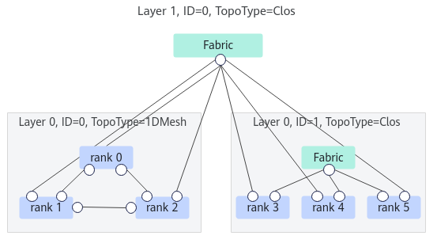

# HcclRankGraphGetInstSizeListByLayer<a name="ZH-CN_TOPIC_0000002539660977"></a>

## 产品支持情况<a name="section10594071513"></a>

<a name="zh-cn_topic_0000001264921398_table38301303189"></a>
<table><thead align="left"><tr id="zh-cn_topic_0000001264921398_row20831180131817"><th class="cellrowborder" valign="top" width="57.99999999999999%" id="mcps1.1.3.1.1"><p id="p1883113061818"><a name="p1883113061818"></a><a name="p1883113061818"></a><span id="ph20833205312295"><a name="ph20833205312295"></a><a name="ph20833205312295"></a>产品</span></p>
</th>
<th class="cellrowborder" align="center" valign="top" width="42%" id="mcps1.1.3.1.2"><p id="zh-cn_topic_0000001264921398_p783113012187"><a name="zh-cn_topic_0000001264921398_p783113012187"></a><a name="zh-cn_topic_0000001264921398_p783113012187"></a>是否支持</p>
</th>
</tr>
</thead>
<tbody><tr id="zh-cn_topic_0000001264921398_row220181016240"><td class="cellrowborder" valign="top" width="57.99999999999999%" headers="mcps1.1.3.1.1 "><p id="p48327011813"><a name="p48327011813"></a><a name="p48327011813"></a><span id="ph583230201815"><a name="ph583230201815"></a><a name="ph583230201815"></a><term id="zh-cn_topic_0000002534508309_term1253731311225"><a name="zh-cn_topic_0000002534508309_term1253731311225"></a><a name="zh-cn_topic_0000002534508309_term1253731311225"></a>Atlas A3 训练系列产品</term>/<term id="zh-cn_topic_0000002534508309_term131434243115"><a name="zh-cn_topic_0000002534508309_term131434243115"></a><a name="zh-cn_topic_0000002534508309_term131434243115"></a>Atlas A3 推理系列产品</term></span></p>
</td>
<td class="cellrowborder" align="center" valign="top" width="42%" headers="mcps1.1.3.1.2 "><p id="zh-cn_topic_0000001264921398_p7948163910184"><a name="zh-cn_topic_0000001264921398_p7948163910184"></a><a name="zh-cn_topic_0000001264921398_p7948163910184"></a>√</p>
</td>
</tr>
<tr id="zh-cn_topic_0000001264921398_row173226882415"><td class="cellrowborder" valign="top" width="57.99999999999999%" headers="mcps1.1.3.1.1 "><p id="p14832120181815"><a name="p14832120181815"></a><a name="p14832120181815"></a><span id="ph1292674871116"><a name="ph1292674871116"></a><a name="ph1292674871116"></a><term id="zh-cn_topic_0000002534508309_term11962195213215"><a name="zh-cn_topic_0000002534508309_term11962195213215"></a><a name="zh-cn_topic_0000002534508309_term11962195213215"></a>Atlas A2 训练系列产品</term>/<term id="zh-cn_topic_0000002534508309_term184716139811"><a name="zh-cn_topic_0000002534508309_term184716139811"></a><a name="zh-cn_topic_0000002534508309_term184716139811"></a>Atlas A2 推理系列产品</term></span></p>
</td>
<td class="cellrowborder" align="center" valign="top" width="42%" headers="mcps1.1.3.1.2 "><p id="zh-cn_topic_0000001264921398_p19948143911820"><a name="zh-cn_topic_0000001264921398_p19948143911820"></a><a name="zh-cn_topic_0000001264921398_p19948143911820"></a>√</p>
</td>
</tr>
</tbody>
</table>

## 功能说明<a name="section30123063"></a>

给定通信域和拓扑层级编号，查询该层级下的拓扑实例数量，以及每个实例包含的rank数量。



以上述拓扑模型为例：

-   Layer 0中包含两个拓扑实例，为方便理解，定义拓扑实例ID分别为0和1，每个实例中分别包含3个rank。
-   Layer1中包含1个拓扑实例，实例中包含6个rank。

## 函数原型<a name="section62999330"></a>

```
HcclResult HcclRankGraphGetInstSizeListByLayer(HcclComm comm, uint32_t netLayer, uint32_t **instSizeList, uint32_t *listSize)
```

## 参数说明<a name="section2672115"></a>

<a name="table66471715"></a>
<table><thead align="left"><tr id="row24725298"><th class="cellrowborder" valign="top" width="20.200000000000003%" id="mcps1.1.4.1.1"><p id="p56592155"><a name="p56592155"></a><a name="p56592155"></a>参数名</p>
</th>
<th class="cellrowborder" valign="top" width="17.169999999999998%" id="mcps1.1.4.1.2"><p id="p20561848"><a name="p20561848"></a><a name="p20561848"></a>输入/输出</p>
</th>
<th class="cellrowborder" valign="top" width="62.629999999999995%" id="mcps1.1.4.1.3"><p id="p54897010"><a name="p54897010"></a><a name="p54897010"></a>描述</p>
</th>
</tr>
</thead>
<tbody><tr id="row17472816"><td class="cellrowborder" valign="top" width="20.200000000000003%" headers="mcps1.1.4.1.1 "><p id="p12360155116113"><a name="p12360155116113"></a><a name="p12360155116113"></a>comm</p>
</td>
<td class="cellrowborder" valign="top" width="17.169999999999998%" headers="mcps1.1.4.1.2 "><p id="p171991056191118"><a name="p171991056191118"></a><a name="p171991056191118"></a>输入</p>
</td>
<td class="cellrowborder" valign="top" width="62.629999999999995%" headers="mcps1.1.4.1.3 "><p id="p5431913128"><a name="p5431913128"></a><a name="p5431913128"></a>通信域。</p>
<p id="p9992193923616"><a name="p9992193923616"></a><a name="p9992193923616"></a>HcclComm类型的定义如下：</p>
<a name="screen5220172285515"></a><a name="screen5220172285515"></a><pre class="screen" codetype="C" id="screen5220172285515">typedef void *HcclComm;</pre>
</td>
</tr>
<tr id="row63522246"><td class="cellrowborder" valign="top" width="20.200000000000003%" headers="mcps1.1.4.1.1 "><p id="p8360155117113"><a name="p8360155117113"></a><a name="p8360155117113"></a>netLayer</p>
</td>
<td class="cellrowborder" valign="top" width="17.169999999999998%" headers="mcps1.1.4.1.2 "><p id="p819985612117"><a name="p819985612117"></a><a name="p819985612117"></a>输入</p>
</td>
<td class="cellrowborder" valign="top" width="62.629999999999995%" headers="mcps1.1.4.1.3 "><p id="p634222502314"><a name="p634222502314"></a><a name="p634222502314"></a>拓扑层级编号。</p>
</td>
</tr>
<tr id="row20735233"><td class="cellrowborder" valign="top" width="20.200000000000003%" headers="mcps1.1.4.1.1 "><p id="p113601251141112"><a name="p113601251141112"></a><a name="p113601251141112"></a>instSizeList</p>
</td>
<td class="cellrowborder" valign="top" width="17.169999999999998%" headers="mcps1.1.4.1.2 "><p id="p16199175619112"><a name="p16199175619112"></a><a name="p16199175619112"></a>输出</p>
</td>
<td class="cellrowborder" valign="top" width="62.629999999999995%" headers="mcps1.1.4.1.3 "><p id="p17904174517"><a name="p17904174517"></a><a name="p17904174517"></a>该层级下每个拓扑实例包含的rank数量组成的列表。</p>
</td>
</tr>
<tr id="row3556144611120"><td class="cellrowborder" valign="top" width="20.200000000000003%" headers="mcps1.1.4.1.1 "><p id="p136014511115"><a name="p136014511115"></a><a name="p136014511115"></a>listSize</p>
</td>
<td class="cellrowborder" valign="top" width="17.169999999999998%" headers="mcps1.1.4.1.2 "><p id="p419945621118"><a name="p419945621118"></a><a name="p419945621118"></a>输出</p>
</td>
<td class="cellrowborder" valign="top" width="62.629999999999995%" headers="mcps1.1.4.1.3 "><p id="p343713122"><a name="p343713122"></a><a name="p343713122"></a>instSizeList的大小，即该层级下包含的拓扑实例的数量。</p>
</td>
</tr>
</tbody>
</table>

## 返回值<a name="section24049039"></a>

[HcclResult](../../comm_mgr_api_c/context/HcclResult.md)：接口成功返回HCCL\_SUCCESS，其他失败。

## 约束说明<a name="section15114764"></a>

无

## 调用示例<a name="section204039211474"></a>

以[功能说明](#section30123063)的拓扑模型为例：

```
HcclComm comm;
uint32_t *instSizeList;
uint32_t listSize;
HcclRankGraphGetInstSizeListByLayer(comm, 0, &instSizeList, &listSize);
// instSizeList=[3,3], listSize=2
HcclRankGraphGetInstSizeListByLayer(comm, 1, &instSizeList, &listSize);
// instSizeList=[6], listSize=1
```

