# 算法分析器工具用户指南

## 工具简介

HCCL算法分析器用于在离线环境中模拟HCCL算法的运行，验证算法逻辑及内存操作等功能。HCCL算法分析器提供了高效、快捷的批量执行测试任务，满足开发者的运行诉求。

## 原理介绍

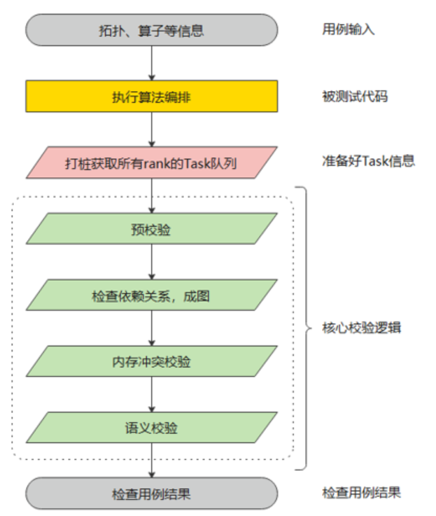

**几个关键点：**

1. 算法分析器通过对平台和框架层进行打桩，在算法执行的过程可以获取到所有rank的Task序列。
2. 将所有Rank的Task信息组成一张**有向无环图**。
3. 基于**图算法**做一些校验，比如内存读写冲突校验，语义校验。1）内存冲突校验会基于图中的同步情况分析是否存在可能的读写冲突。2）语义校验通过模拟执行Task图，记录**数据的搬运信息**，模拟执行完成后检查UserOutput内存中**数据搬运信息**是否符合算子的要求。

## 环境准备

参照[源码构建](../../../docs/build.md)中的环境准备，源码下载，进行算法分析器编译前的准备工作。

## 用例编写

### LLT用例一览

一个算法checker用例分为5个步骤，分别如下图5个框框所示，接下来依次介绍下每个步骤的写法，以适应不同的算子需求。并介绍下出现问题之后，如何借助checker工具进行问题定位。

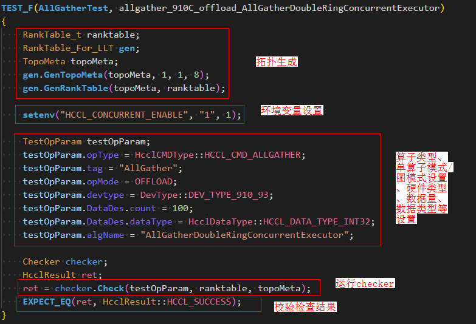

### LLT用例各步骤详解

#### 拓扑生成

- TopoMeta结构体介绍

  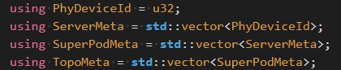

  checker：使用TopoMeta来表示一个拓扑结构，TopoMeta是一个三层vector结构。

  PhyDeviceId：表示一个NPU的物理Id。

  ServerMeta：由PhyDeviceId组成，表示一个服务器的卡数及对应的PhyDeviceId。

  SuperPodMeta：由ServerMeta组成，表示组成超节点的服务器情况。

  TopoMeta：表示集群的整体拓扑情况。

- TopoMeta生成方式

  TopoMeta生成有两种方式：

  1. 指定超节点个数、服务器个数、每个服务器的卡数，然后利用RankTable_For_LLT类提供的GenTopoMeta函数来生成，适用于对称拓扑场景。

     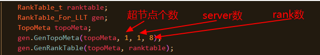

  2. 对超节点、服务器、卡数等完全定制，适用非对称拓扑场景。如下图，TopoMeta中有一个超节点，超节点内有两个server，一个server有2张卡，一个server有3张卡

     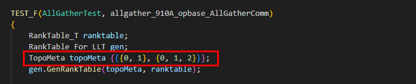

- rank table生成

  有了TopoMeta之后，利用RankTable_For_LLT类提供的GenRankTable函数即可生成rank table。

#### 环境变量设置

- 设置环境变量

  环境变量会影响代码中的判断逻辑，通过setenv函数可以在用例执行前设置好用例需要的条件。

- 清理环境变量

  因为环境变量是进程级别的，一个LLT任务在同一个进程中执行，环境变量的使用可能会影响其他的用例执行。为了清理环境变量，目前在测试套中的TearDown函数中调用了清理环境变量的函数。

  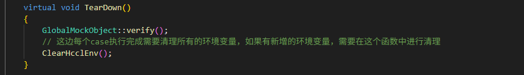

  目前清理环境变量的函数会清理如下的环境变量，如果后续有新增的环境变量，需要在这个函数中进行补充。

  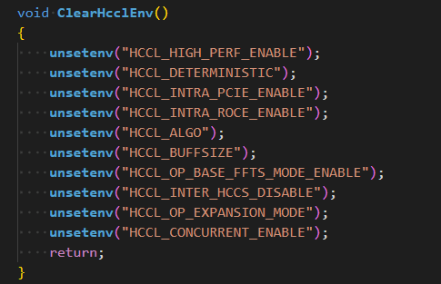

#### 日志级别设置

- checker日志级别(默认ERROR级别)

   1. 调用接口`setCheckerLogWarn()`设置日志级别

        将checker日志级别设置为WARNING：

        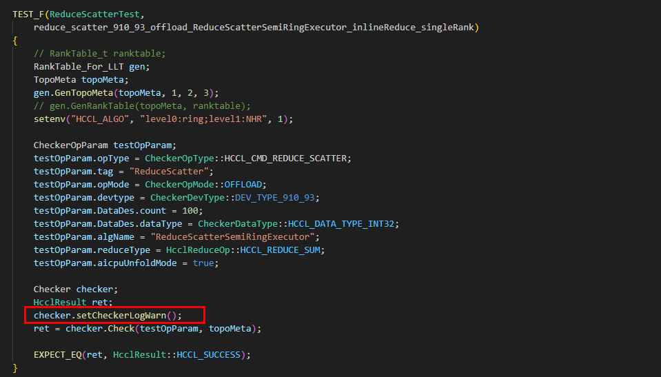

   2. 通过环境变量设置日志级别
 
        打开WARNING级别日志：

        ```bash
        export CHECK_LOG_LEVEL=2
        ```

        打开ERROR级别日志：

        ```bash
        export CHECK_LOG_LEVEL=3
        ```

- HCCL日志级别(默认ERROR级别)

   当前设置环境变量的方式失效，用下面这种方法设置日志级别并打印。

   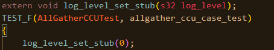

   打开DEBUG级别日志：

   ```
   export ASCEND_LOG_LEVEL=0
   ```

   打开INFO级别日志：

   ```
   export ASCEND_LOG_LEVEL=1
   ```

   打开WARNING级别日志：

   ```
   export ASCEND_LOG_LEVEL=2
   ```

   打开ERROR级别日志：

   ```
   export ASCEND_LOG_LEVEL=3
   ```

#### 算子参数设置

TestOpParam用来设置测试参数，下表介绍其主要使用的一些参数。

| 参数名称   | 必选 or 可选 | 作用                              | 备注                                               |
| ---------- | ------------ | --------------------------------- | -------------------------------------------------- |
| opType     | 必选         | 指定被测试算子类型                | 当前batchsendrecv还在开发中                        |
| tag        | 必选         | 及算子执行入口的tag               | 随意设置即可                                       |
| algName    | 可选         | 指定执行的算法名称                | 若指定则跳过算法选择流程，若不指定，则自动选择算法 |
| opMode     | 必选         | 指定单算子模式或图模式            |                                                    |
| reduceType | 可选         | 涉及reduce类型时需指定            |                                                    |
| devtype    | 必选         | 执行运行的硬件类型                | 支持310P3 V卡/310P3 Duo卡/910A/910B/910C           |
| is310P3V   | 可选         | 运行环境为310P3 V卡时需设置为true |                                                    |
| count      | 必选         | 数据个数                          |                                                    |
| dataType   | 必选         | 数据类型                          |                                                    |

#### 运行checker

将前述步骤生成的TestOpParam、rankTable、TopoMeta等参数送给Checker对象的Check函数执行即可。

#### 校验检查结果

检查Check返回值为HcclResult::HCCL_SUCCESS即可。

### LLT用例过滤

用例较多，仅需执行某个用例时，修改main.cc中用例名称即可。

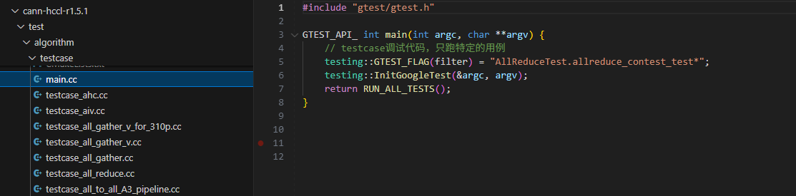

## 用例执行

在源码仓根目录下，按如下命令，编译并执行算法分析器用例：

```
# 编译所有测试套用例，并自动执行
bash build.sh --st

# 编译单个测试套用例，并自动执行
bash build.sh --open_hccl_test
bash build.sh --executor_hccl_test
bash build.sh --executor_reduce_hccl_test
bash build.sh --executor_pipeline_hccl_test

# 手动执行测试用例
./build/test/st/algorithm/testcase/testcase/open_hccl_test
./build/test/st/algorithm/testcase/testcase/executor_hccl_test
./build/test/st/algorithm/testcase/testcase/executor_reduce_hccl_test
./build/test/st/algorithm/testcase/testcase/executor_pipeline_hccl_test
```

## 结果示例

### 结果解析

用例执行结果如下所示：

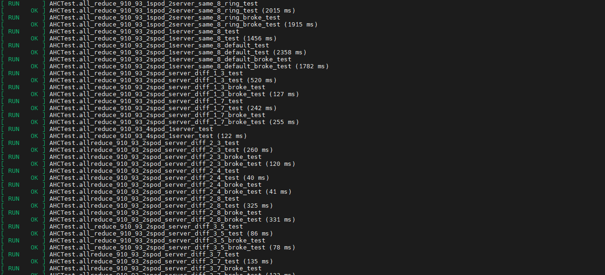

各字段含义如下：

[run]：表示执行验证的用例

\[OK\]：表示执行成功，验证通过

\[FAIL\]：表示执行失败，具体原因根据打屏日志进行分析。

## 问题定位

### 内存冲突校验定位方法

#### 问题现象

当两个同步信号之间的某片内存被多个task并发写入，或者在被读取的同时被写入，就会发生内存冲突。这种情况下，在实际运行环境中通常会表现为随机出现的精度问题。

当前Mesh结构下，若存在Reduce算子，可能存在误报的情况。原因是Mesh结构下，可能会出现某块内存在一个同步之间被其他卡同时写入的情况。此时硬件可以确保Reduce操作的原子性，在实际运行中不会出现精度问题，但从checker的角度来看，确实是两个同步之间对同一内存进行了多次读写操作，因为会被认为错误。

除上述场景以外，出现如下报错则认为task编排中有内存冲突的风险：

```
[1]there is memory use confilict in two SliceMemoryStatus
[2]one is startAddr is 0, size  is 3200, status is WRITE.
[3]another is startAddr is 0, size  is 3200, status is WRITE.
[4]failed to check memory BufferType::OUTPUT_CCL
[5]memory conflict between node [rankId:1, queueId:0, index:1] and node [rankId:2, queueId:0, index:1]
[6]check rank memory conflict failed for rank 0
```

-   第2、3句表示冲突的两个内存块的起始地址（startAddr）、大小（size）以及读写状态（status）。

    status有READ和WRITE两个状态，READ表示该内存块正在被读，WRITE表示该内存块正在被写。被读和被写是抽象的内存操作语义，不仅仅是write task和read task。

    可能是READ状态的内存块包括localcopy任务的src，read任务的src，write任务的src；可能是WRITE状态的内存块包括localcopy任务的dst，read任务的dst，write任务的dst。

-   第4句表示冲突内存块的类型。
-   第5句说明了是哪两个task造成的内存冲突。
-   第6句说明了产生内存冲突的rank号。

上述错误日志说明同时有两个task在往OUTPUT\_CCL类型的0\~3200的范围内执行写入操作。

#### 定位方法

1.  在调用Check函数前打开task打印开关。

    ```
    checker.EnableTaskPrint();
    ```

2.  根据报错日志找到造成内存冲突的两个task，排查这两个task前后同步的编排。

    [问题现象](#zh-cn_topic_0000002306628476_section158963105533)中的错误日志说明同时有两个task在往OUTPUT\_CCL类型的0\~3200的范围内执行写入操作。

### 语义校验失败定位方法

#### 语义校验基础概念

算法分析器中内存使用相对地址进行表示，由三个字段组成：内存类型、偏移地址offset、大小size，用结构体DataSlice表示：

```
class DataSlice {
public:
    //  一些方法函数

private:
    BufferType type;
    u64        offset;
    u64        size;
}
```

内存支持Input、Output、CCL\_Input、CCL\_Output、Scratch等类型。

集合通信算法在运行过程中会涉及复杂的数据搬运、规约操作，算法分析器用**BufferSemantic（语义）**记录**数据搬运关系**，其中有目的内存表达和多个源内存表达。目的内存通过成员变量startAddr和Size表示；源内存用结构体SrcBufDes表示，结构体定义如下：

```
struct BufferSemantic {
    u64                         startAddr;
    mutable u64                 size;       // 大小，源内存和目的内存共享相同的大小
    mutable bool                isReduce;   // 是否做了reduce操作，srcBufs有多个的时候必定是reduce场景
    mutable HcclReduce0p        reduceType; // reduce操作的类型
    mutable std::set<SrcBufDes> srcBufs;    //这块数据来自哪个或哪些rank
};

struct SrcBufDes {
    RankId      rankId;   // 数据源的rankId
    BufferType  bufType;   // 数据源的内存类型
    mutable u64 srcAddr;  // 相对于数据源内存类型的偏移地址
};
```

#### 语义计算举例

下面已具体例子介绍什么是语义计算。

1.  初始状态，有Rank0与Rank1两个Rank，有Input，Output两种内存类型。

    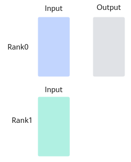

2.  状态一动作：将rank0的Input，偏移地址20，大小为30的数据块搬运到rank0的Output，偏移地址为35结果：在rank0的Output上产生了一个语义块，记录了本次搬运的信息。

    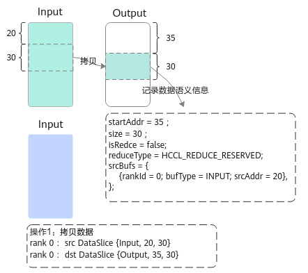

3.  状态二动作：将rank1的Input，偏移地址70，大小为15的数据块搬运到rank0的Output，偏移地址为50结果：目的内存与现有的语义块有重叠，需要对现有的语义块进行拆分，产生两条语义块。

    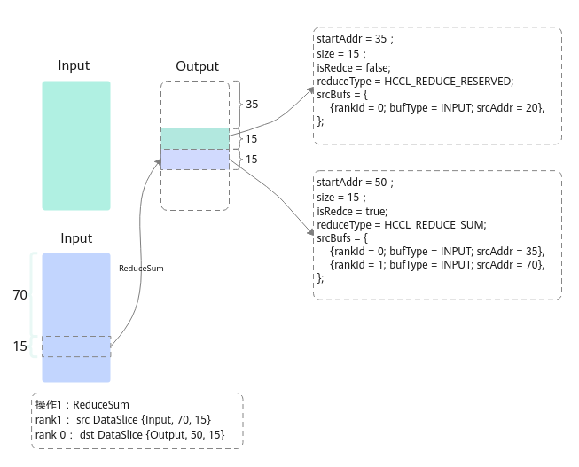

#### 结果校验

语义分析执行的过程中产生很多语义块（即记录了很多数据搬运关系）。执行完成后，校验Output内存中的语义块是否符合预期。

接下来以2 rank做AllGather举例，说明Rank0的Output内存中语义块的正常场景和异常场景。假设输入数据大小是100字节。

-   **正确场景：**

    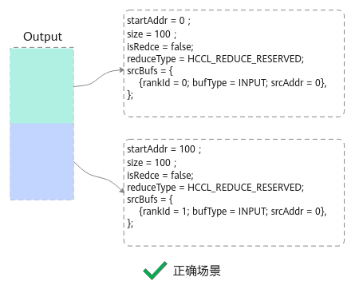

-   **错误场景：**

    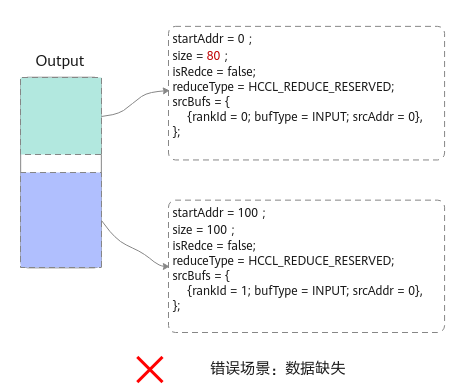

#### 定位思路

语义校验阶段可以发现两种类型的错误：

-   数据缺失。
-   数据来源错误。

扩展到规约场景，也有类似的问题，比如参与规约的rank数量缺失、参与规约的数据偏移地址不一样等。通常情况下，语义报错的时候会给出一定的提示信息。需要借助提示信息，并结合算法分析器打印的task序列进行具体分析，task打印信息添加方法可参见《集合通信源码定制开发指南》中的“编写checker用例”章节。
